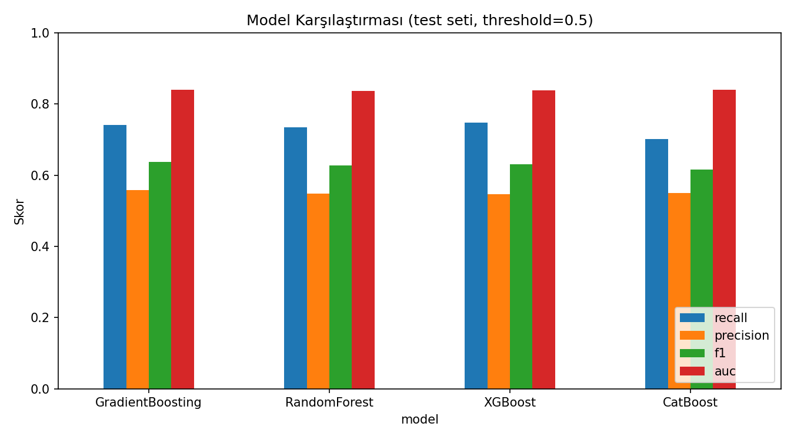

# Müşteri Churn Tahmini — Python / scikit-learn Pipeline

Bir telekom şirketinin müşteri churn (kayıp) davranışını tahmin etmek için geliştirilmiş
uçtan uca bir makine öğrenmesi pipeline'ı. [IBM Telco Customer Churn](https://www.kaggle.com/datasets/blastchar/telco-customer-churn)
(Kaggle) veri seti kullanılarak Python ve scikit-learn ekosistemiyle geliştirildi.

## İçindekiler
- [Problem Tanımı](#problem-tanımı)
- [Veri Seti](#veri-seti)
- [Metodoloji](#metodoloji)
- [Kurulum](#kurulum)
- [Sonuçlar](#sonuçlar)
- [Sınırlamalar](#sınırlamalar)
- [Proje Yapısı](#proje-yapısı)

## Problem Tanımı
Bir telekom şirketinin mevcut müşterilerinden hangilerinin önümüzdeki dönemde hizmeti
bırakacağını (churn) önceden tahmin etmek. Dengesiz bir ikili sınıflandırma problemi
(churn oranı ~%26,5) — churn eden azınlık sınıfını doğru yakalamak (recall), gereksiz yere
"ayrılacak" etiketi yapıştırmamak (precision) arasındaki dengeyi kurmak gerekiyor.

## Veri Seti
- Kaynak: [IBM Telco Customer Churn (Kaggle)](https://www.kaggle.com/datasets/blastchar/telco-customer-churn)
- 7.043 müşteri, 20 ham değişken + hedef (`Churn`)
- Churn oranı: **%26,5** (dengesiz veri)
- Bilinen veri kalitesi sorunu: `TotalCharges` sayısal olmasına rağmen string olarak
  saklanıyor, `tenure=0` olan 11 yeni müşteri için boş değer içeriyor (bkz. `src/data_loading.py`)

## Metodoloji

| Aşama | Ne yapıldı | Kod |
|---|---|---|
| Veri temizliği | Tip düzeltme, mantıklı imputation (satır silmeden) | `src/data_loading.py::basic_clean` |
| EDA | Cardinality analizi, outlier capping, Cramér's V, point-biserial korelasyon, multicollinearity kontrolü | `src/eda.py` |
| Leakage tespiti | Tek-kolon ablation: single-feature AUC + baseline'dan kolon çıkararak performans düşüşü ölçme | `src/leakage.py` |
| Feature engineering | Kolon ailelerinden agregasyon (toplam sayım feature'ı), tenure'dan risk segmenti | `src/preprocessing.py::engineer_features` |
| Split | Stratified 75/25, seed=42 | `src/preprocessing.py::stratified_split` |
| Encoding | `ColumnTransformer` (StandardScaler + OneHotEncoder), kolon adı hardcode edilmeden dinamik | `src/preprocessing.py` |
| Dengesiz veri | SMOTE, yalnızca train fold'unda, CV-leakage'siz (`imblearn.pipeline.Pipeline`) | `src/imbalance.py` |
| Feature selection | Genetik Algoritma (population=10, generations=8, F1 objective) | `sklearn-genetic-opt` (`src/feature_selection.py`) |
| Modelleme | GradientBoosting / RandomForest / XGBoost / CatBoost, `RandomizedSearchCV` ile hyperparameter tuning | `src/modeling.py` |
| Değerlendirme | F1/Recall/Precision/AUC, threshold tuning, model karşılaştırma | `src/evaluation.py` |

Uçtan uca çalıştırılabilir hali: [`notebooks/01_full_pipeline.ipynb`](notebooks/01_full_pipeline.ipynb)
(gerçek çıktılar/grafikler dahil) veya `python scripts/run_pipeline.py`.

## Kurulum
```bash
git clone <repo-url>
cd customer-churn-prediction
python -m venv venv && source venv/bin/activate  # Windows: venv\Scripts\activate
pip install -r requirements.txt
```

Veri setini [Kaggle - Telco Customer Churn](https://www.kaggle.com/datasets/blastchar/telco-customer-churn)
adresinden indirip `data/raw/telco_customer_churn.csv` olarak kaydedin, ardından:

```bash
python scripts/run_pipeline.py       # uçtan uca pipeline, reports/ ve models/ altına kaydeder
jupyter notebook notebooks/01_full_pipeline.ipynb   # adım adım, açıklamalı versiyon
```

## Sonuçlar

Leakage testi: **hiçbir kolon tek başına anormal (>0.9) AUC vermiyor**, en yüksek tekil AUC
`tenure` ile 0.74 — leakage şüphesi bulunamadı. Genetik algoritma, 47 encoded feature'dan
**21 tanesini** seçti (`reports/selected_features.json`).

Dört modelin test seti performansı (seçilmiş feature seti, threshold=0.5):

| Model | CV F1 | Test AUC | Recall | Precision | F1 | Accuracy |
|---|---|---|---|---|---|---|
| **GradientBoosting** (kazanan) | 0.627 | 0.840 | 0.741 | 0.558 | **0.637** | 0.776 |
| CatBoost | 0.631 | 0.841 | 0.702 | 0.549 | 0.617 | 0.768 |
| XGBoost | 0.631 | 0.839 | 0.747 | 0.546 | 0.631 | 0.768 |
| RandomForest | 0.631 | 0.837 | 0.734 | 0.549 | 0.628 | 0.769 |

Dört model birbirine çok yakın performans gösterdi (F1 0.62-0.64, AUC ~0.84) — bu, sinyalin
büyük kısmının feature mühendisliğinden/veri kalitesinden geldiğini, model seçiminin bu
veri setinde ikincil bir etken olduğunu gösteriyor. Threshold tarama analizi (bkz.
`reports/figures/threshold_tradeoff.png`), varsayılan 0.5 eşiğinin zaten F1-optimal nokta
olduğunu doğruladı.



## Sınırlamalar
- GA feature selection'da hız için proxy model (Lojistik Regresyon) kullanıldı; asıl
  modellerle (örn. XGBoost) çalıştırmak farklı bir alt küme seçebilirdi.
- Zaman/hesaplama kısıtı nedeniyle `RandomizedSearchCV` (n_iter=25) tercih edildi; daha
  kapsamlı bir `GridSearchCV` taraması farklı (muhtemelen biraz daha iyi) sonuçlar verebilir.
- Veri seti tek bir zaman kesitini yansıtıyor; ayrı, zamansal bir validasyon kümesi (örn.
  en güncel N ayı test için ayırmak) kurulamadı.

## Proje Yapısı
```
customer-churn-prediction/
├── data/raw/                    # Ham veri (repoya dahil değil, Kaggle'dan indirilir)
├── notebooks/
│   └── 01_full_pipeline.ipynb   # Uçtan uca, açıklamalı, çalıştırılmış notebook
├── scripts/
│   └── run_pipeline.py          # Aynı pipeline'ın komut satırından çalıştırılabilir hali
├── src/
│   ├── data_loading.py          # Veri yükleme + temizlik
│   ├── eda.py                   # İstatistiksel EDA (Cramér's V, point-biserial, vb.)
│   ├── leakage.py               # Tek-kolon ablation ile leakage tespiti
│   ├── preprocessing.py         # Feature engineering, encoding, split
│   ├── imbalance.py             # SMOTE (train-only) pipeline'ı
│   ├── feature_selection.py     # Genetik algoritma ile feature selection
│   ├── modeling.py              # 4 model + hyperparameter tuning
│   └── evaluation.py            # Metrikler, threshold tuning, karşılaştırma
├── tests/                       # Birim testleri
├── models/                      # Eğitilmiş model (repoya dahil değil, .gitignore'da)
├── reports/                     # Üretilen tablolar ve grafikler
└── requirements.txt
```
