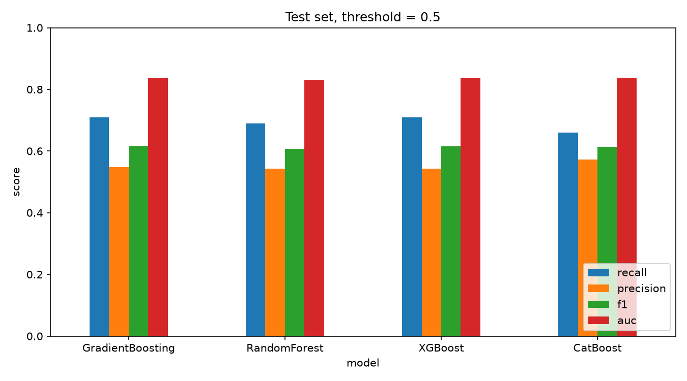

# Customer churn prediction

Churn prediction on the [IBM Telco Customer Churn](https://www.kaggle.com/datasets/blastchar/telco-customer-churn)
dataset (7,043 customers, 26.5% churn). I first built a similar pipeline in
KNIME; this is the Python version on public data.

The notebook [`notebooks/01_full_pipeline.ipynb`](notebooks/01_full_pipeline.ipynb)
goes through every step with the outputs. `scripts/run_pipeline.py` runs the
same steps and saves the tables to `reports/`.

## Steps

| Step | What | Code |
|---|---|---|
| Cleaning | `TotalCharges` is text and blank for tenure = 0, set to 0 | `src/data_loading.py` |
| EDA | missing/constant columns, Cramér's V, point-biserial correlation, correlated pairs | `src/eda.py` |
| Leakage checks | single-column AUC and AUC drop when a column is removed | `src/leakage.py` |
| Features | number of add-on services, tenure buckets, TotalCharges / (tenure × MonthlyCharges) | `src/preprocessing.py` |
| Split / encoding | stratified 75/25, `ColumnTransformer` fitted on train only | `src/preprocessing.py` |
| Imbalance | SMOTE inside an imblearn `Pipeline`, so it only touches the training folds | `src/imbalance.py` |
| Feature selection | genetic algorithm (sklearn-genetic-opt), F1, logistic regression as the fast model | `src/feature_selection.py` |
| Models | GradientBoosting, RandomForest, XGBoost, CatBoost with `RandomizedSearchCV` | `src/modeling.py` |
| Threshold | chosen on out-of-fold predictions of the training set | `src/evaluation.py` |

## Results

No column looks like leakage: the best single column is `tenure` (AUC 0.74)
and removing any column lowers the AUC by at most 0.008. The GA kept 30 of
47 encoded features.

Test set, threshold 0.5:

| Model | CV F1 | AUC | Recall | Precision | F1 |
|---|---|---|---|---|---|
| GradientBoosting | 0.625 | 0.838 | 0.709 | 0.547 | 0.618 |
| RandomForest | 0.627 | 0.831 | 0.690 | 0.542 | 0.607 |
| XGBoost | 0.625 | 0.837 | 0.709 | 0.543 | 0.615 |
| CatBoost | 0.627 | 0.838 | 0.660 | 0.572 | 0.613 |

The four models are within ~0.01 of each other, which is within noise for a
test set with 467 churners. I chose the model by CV F1 (RandomForest) so the
test set isn't used for model selection. The F1-optimal threshold on the
out-of-fold predictions was 0.5; a lower threshold (0.3–0.4) raises recall to
0.77–0.85 with a small F1 loss, which is better if missing a churner costs
more than an unnecessary retention offer.

Some things from the EDA:

- Contract type has the strongest relation with churn (Cramér's V 0.41).
- Customers in their first year churn at 47%, after 5 years at 7%.
- Customers with exactly one add-on service churn the most (46%).



## Limitations

- The GA uses logistic regression for speed; with the tree models it could
  pick different columns.
- `RandomizedSearchCV` with 25 candidates, not a full grid search.
- The data is one snapshot with no dates, so there is no out-of-time test.

## Running it

```bash
git clone https://github.com/nazlicanparali/customer-churn-prediction.git
cd customer-churn-prediction
python -m venv venv
source venv/bin/activate        # Windows: venv\Scripts\activate
pip install -r requirements.txt
```

Download the data from [Kaggle](https://www.kaggle.com/datasets/blastchar/telco-customer-churn)
and save it as `data/raw/telco_customer_churn.csv`. Then:

```bash
python scripts/run_pipeline.py     # about 8-10 minutes
pytest
jupyter notebook notebooks/01_full_pipeline.ipynb
```

Numbers can differ slightly with other library versions.

## Structure

```
data/raw/            data (not in the repo)
notebooks/           full pipeline with outputs
scripts/             run_pipeline.py
src/                 data_loading, eda, leakage, preprocessing, imbalance,
                     feature_selection, modeling, evaluation
tests/
reports/             tables and figures from run_pipeline.py
models/              saved model (not in the repo)
```
